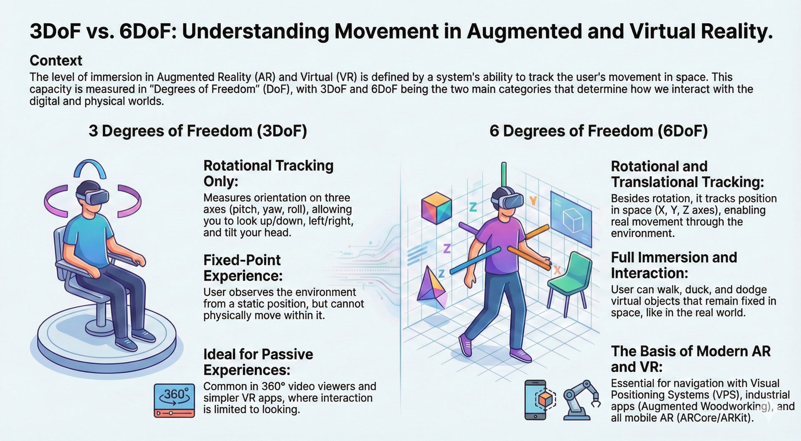
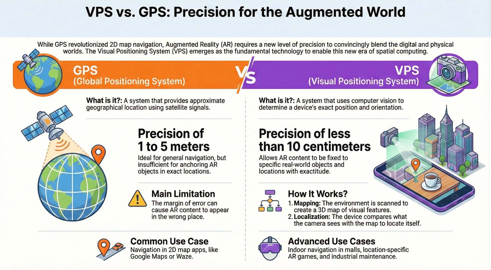
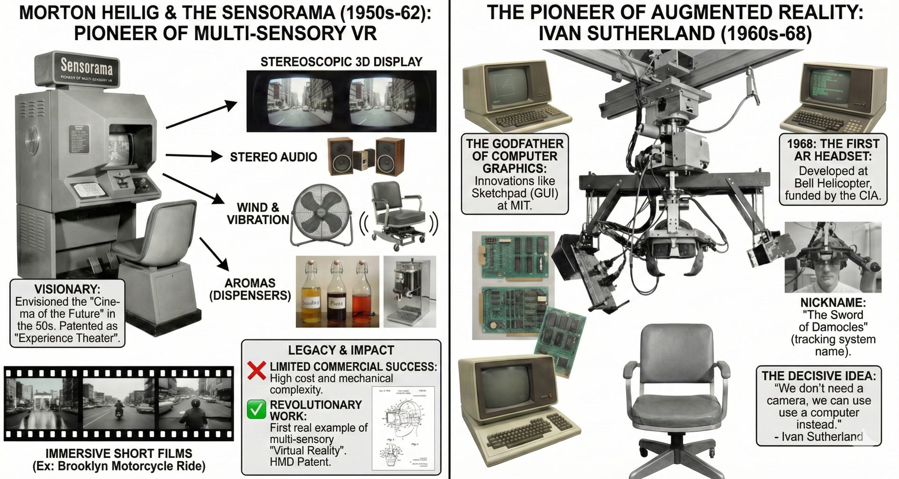
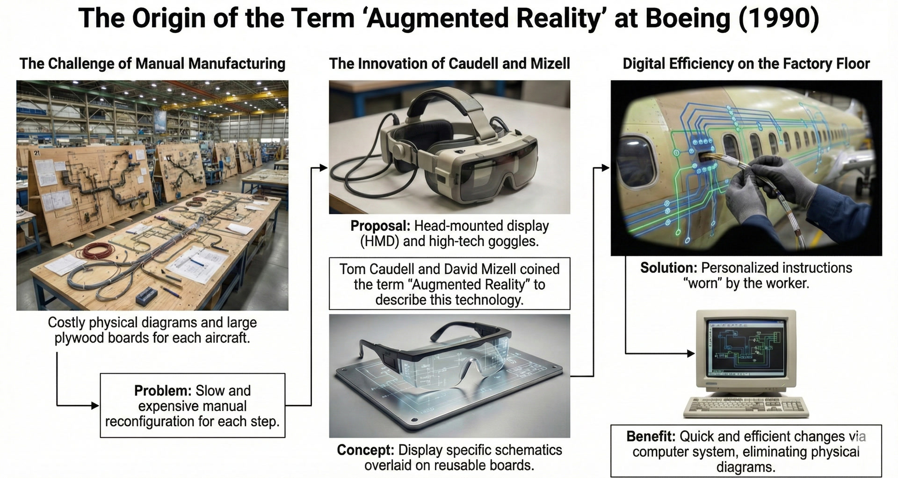
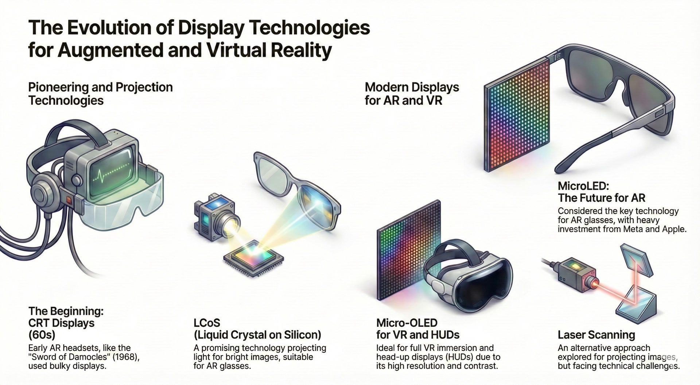
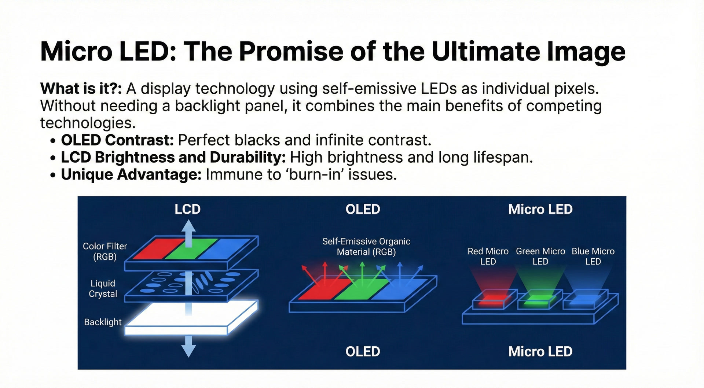
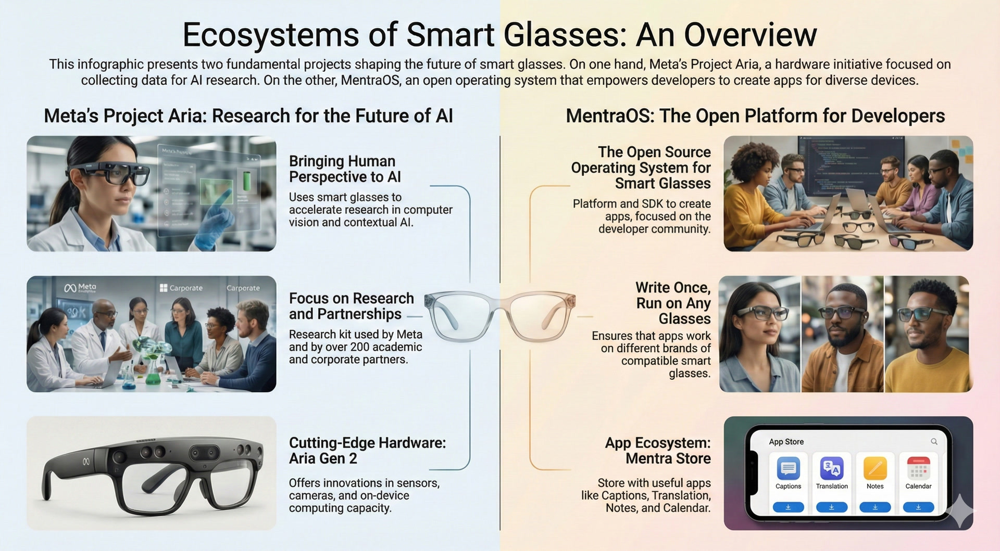
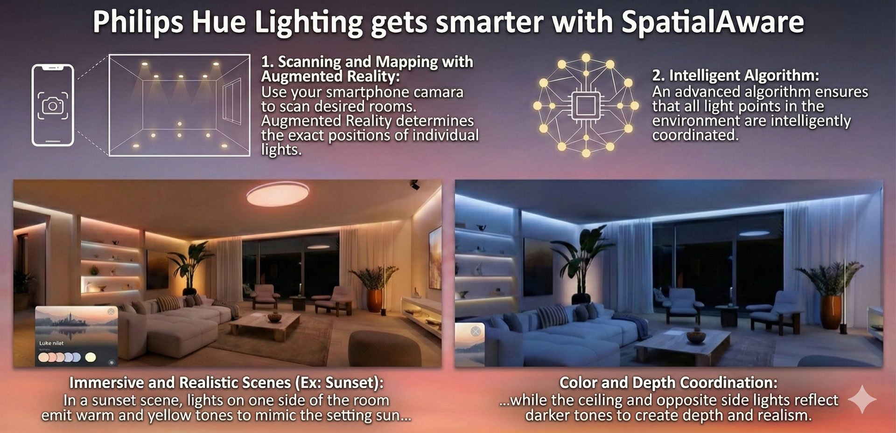
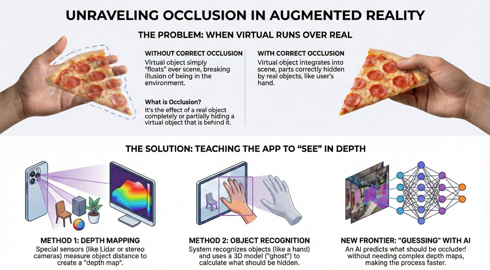
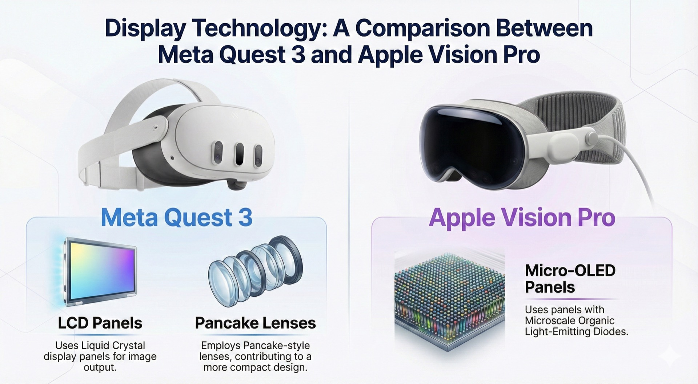

::: {.column-page}

  <a href="ai-assets/slides/1.jpg" class="slide-item" onclick="openLightbox(event, this.href)">
    
    1
  </a>
  <a href="ai-assets/slides/2.jpg" class="slide-item" onclick="openLightbox(event, this.href)">
    
    2
  </a>
  <a href="ai-assets/slides/3.jpg" class="slide-item" onclick="openLightbox(event, this.href)">
    
    3
  </a>
  <a href="ai-assets/slides/4.jpg" class="slide-item" onclick="openLightbox(event, this.href)">
    
    4
  </a>
  <a href="ai-assets/slides/5.jpg" class="slide-item" onclick="openLightbox(event, this.href)">
    
    5
  </a>
  <a href="ai-assets/slides/6.jpg" class="slide-item" onclick="openLightbox(event, this.href)">
    
    6
  </a>
  <a href="ai-assets/slides/7.jpg" class="slide-item" onclick="openLightbox(event, this.href)">
    
    7
  </a>
  <a href="ai-assets/slides/8.jpg" class="slide-item" onclick="openLightbox(event, this.href)">
    
    8
  </a>
  <a href="ai-assets/slides/9.jpg" class="slide-item" onclick="openLightbox(event, this.href)">
    
    9
  </a>
  <a href="ai-assets/slides/10.jpg" class="slide-item" onclick="openLightbox(event, this.href)">
    
    10
  </a>
  <a href="ai-assets/slides/11.jpg" class="slide-item" onclick="openLightbox(event, this.href)">
    
    11
  </a>
  <a href="ai-assets/slides/12.jpg" class="slide-item" onclick="openLightbox(event, this.href)">
    
    12
  </a>
  <a href="ai-assets/slides/13.jpg" class="slide-item" onclick="openLightbox(event, this.href)">
    
    13
  </a>
  <a href="ai-assets/slides/14.jpg" class="slide-item" onclick="openLightbox(event, this.href)">
    
    14
  </a>
  <a href="ai-assets/slides/15.jpg" class="slide-item" onclick="openLightbox(event, this.href)">
    
    15
  </a>

  <h2 style="color: #666; font-style: italic; letter-spacing: 2px;">WORK IN PROGRESS</h2>
  
This presentation is currently under development.  More slides will be added soon.

  

    <em>Note: Images were generated by Gemini Nano Banana Pro. Please be aware that AI-generated visuals may not always accurately reflect reality.</em>
  

:::

<!-- Lightbox Modal HTML -->

  &times;
  

